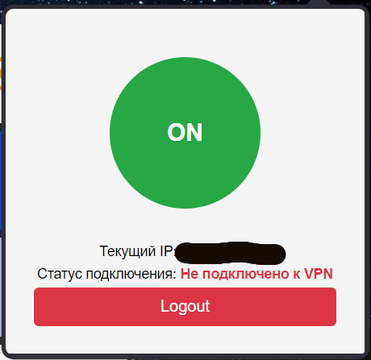
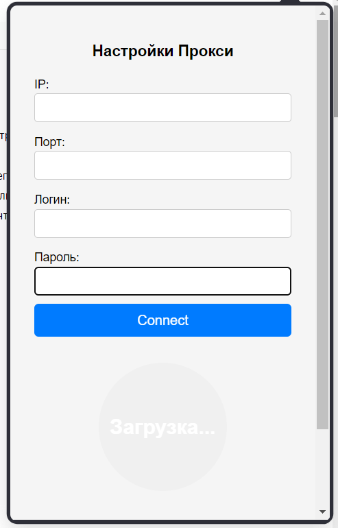

<h1>CASHIMIR SOCKS5</h1>

<strong>CASHIMIR SOCKS5</strong> — это расширение для браузера, которое позволяет легко управлять подключением к SOCKS5-прокси, отображать текущий IP и автоматически отключаться при возникновении ошибок.

<h2>Особенности</h2>
<ul>
  <li>Управление прокси одним кликом.</li>
  <li>Отображение текущего IP-адреса.</li>
  <li>Автоматическое отключение при ошибках прокси (например, если подключение к прокси не удалось).</li>
  <li>Удобная форма для ввода данных прокси-сервера (IP, порт, логин, пароль).</li>
  <li>Поддержка SOCKS5-прокси с аутентификацией.</li>
</ul>

<h2>Использование</h2>
<ol>
  <li>Заполните данные прокси-сервера в форме (IP, порт, логин и пароль).</li>
  <li>Нажмите "Connect", чтобы подключиться к прокси.</li>
  <li>Отображается статус подключения и текущий IP-адрес.</li>
  <li>Для отключения прокси нажмите кнопку "OFF".</li>
  <li>Используйте кнопку "Logout" для очистки данных и отключения прокси.</li>
</ol>

<h2>Скриншоты</h2>

Пример интерфейса:

<h2>Установка</h2>

Чтобы установить расширение:

<ol>
  <li>Скачайте <a href="https://github.com/FSystem88/vpn-for-chrome/archive/refs/heads/main.zip">архив</a> и распакуйте в корень диска</li>
  <li>Откройте настройки браузера и перейдите в раздел "Расширения" (<code>browser://extensions</code>).</li>
  <li>Включите режим разработчика и нажмите "Загрузить распакованное расширение".</li>
  <li>Выберите папку с проектом.</li>
</ol>

<h2>Примечание</h2>

Папку с расширением нельзя удалять, иначе удалится и из браузера

